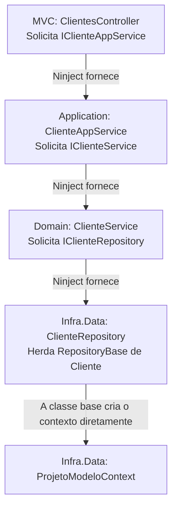
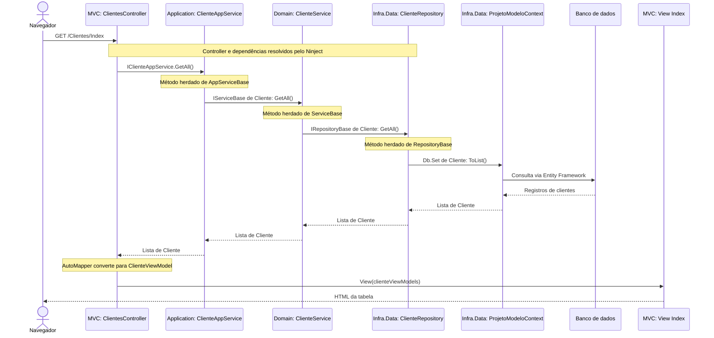
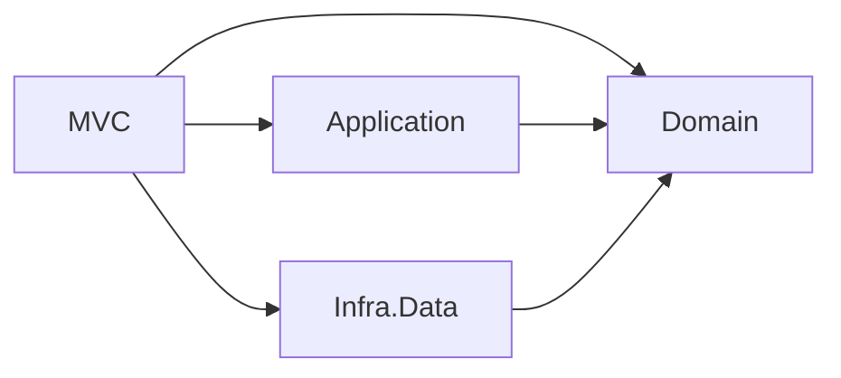

# ProjetoModeloDDD — fluxo de uma request

Este documento acompanha uma requisição real do projeto: **`GET /Clientes/Index`**, que consulta os clientes e apresenta uma tabela no navegador.

## Responsabilidade de cada camada

| Projeto | Responsabilidade | Exemplos |
|---|---|---|
| **MVC** | Receber requisições HTTP, tratar os dados da interface e gerar respostas HTML. | Controllers, ViewModels, Views, AutoMapper e configuração do Ninject. |
| **Application** | Coordenar as operações oferecidas pela aplicação. | `ClienteAppService` e `AppServiceBase<TEntity>`. |
| **Domain** | Representar entidades, regras de negócio e contratos de serviços e repositórios. | `Cliente`, `ClienteService` e `IClienteRepository`. |
| **Infra.Data** | Implementar consultas e gravações usando Entity Framework. | `ClienteRepository`, `RepositoryBase<TEntity>` e `ProjetoModeloContext`. |

Neste exemplo de listagem, Application e Domain encaminham a consulta. A regra de cliente especial é aplicada em outra operação: `ObterClientesEspeciais()`.

## 1. Preparação: registro das dependências

Na inicialização da aplicação, `NinjectWebCommon.Start()` inicializa o kernel. `CreateKernel()` chama `RegisterServices()`, que registra os vínculos entre interfaces e implementações.

Os vínculos específicos de cliente são:

```csharp
kernel.Bind<IClienteAppService>().To<ClienteAppService>();
kernel.Bind<IClienteService>().To<ClienteService>();
kernel.Bind<IClienteRepository>().To<ClienteRepository>();
```

Registrar um vínculo informa ao Ninject qual classe usar quando uma interface for solicitada. A integração `Ninject.MVC5` permite que o MVC obtenha controllers com suas dependências resolvidas.

## 2. O navegador solicita a lista

```http
GET /Clientes/Index
```

A rota definida em `ProjetoModeloDDD.MVC/App_Start/RouteConfig.cs` usa o formato:

```text
{controller}/{action}/{id}
```

Assim, `Clientes` identifica `ClientesController`, `Index` identifica a ação e nenhum `id` é informado.

Antes de executar a ação, o MVC precisa de uma instância do controller.

## 3. O Ninject monta a cadeia de objetos

O construtor de `ClientesController` solicita uma interface:

```csharp
private readonly IClienteAppService _clienteApp;

public ClientesController(IClienteAppService clienteApp)
{
    _clienteApp = clienteApp;
}
```

O Ninject resolve as dependências necessárias para construir esse objeto:



| Objeto a construir | Interface solicitada | Implementação fornecida |
|---|---|---|
| `ClientesController` — MVC | `IClienteAppService` | `ClienteAppService` — Application |
| `ClienteAppService` — Application | `IClienteService` | `ClienteService` — Domain |
| `ClienteService` — Domain | `IClienteRepository` | `ClienteRepository` — Infra.Data |

O contexto tem um tratamento diferente. No código atual, `RepositoryBase<TEntity>` cria o contexto diretamente:

```csharp
protected readonly ProjetoModeloContext Db = new ProjetoModeloContext();
```

Portanto, **`ProjetoModeloContext` não é injetado pelo Ninject nesse fluxo**. O construtor do contexto usa `base("ProjetoModeloDDD")`, que identifica a conexão configurada para a aplicação.

## 4. A ação chama a camada Application

Em `ProjetoModeloDDD.MVC/Controllers/ClientesController.cs`:

```csharp
public ActionResult Index()
{
    var clienteViewModels = Mapper.Map<IEnumerable<Cliente>, IEnumerable<ClienteViewModel>>(_clienteApp.GetAll());
    return View(clienteViewModels);
}
```

A primeira operação necessária é `_clienteApp.GetAll()`.

- **Camada de origem:** MVC.
- **Contrato utilizado:** `IClienteAppService`.
- **Objeto que recebe a chamada:** `ClienteAppService`.
- **Implementação executada:** `GetAll()` herdado de `AppServiceBase<Cliente>`.

## 5. Application chama o serviço de domínio

Em `ProjetoModeloDDD.Application/AppServiceBase.cs`:

```csharp
public IEnumerable<TEntity> GetAll()
{
    return _serviceBase.GetAll();
}
```

Para essa requisição, `TEntity` é `Cliente`. O campo `_serviceBase` tem o tipo `IServiceBase<Cliente>` e contém o objeto `ClienteService` fornecido na construção.

Isso ocorre porque `ClienteAppService` encaminha a dependência ao construtor da classe base:

```csharp
public ClienteAppService(IClienteService clienteService) : base(clienteService)
{
    _clienteService = clienteService;
}
```

O mesmo objeto pode ser usado pelo campo específico `_clienteService` e pelo campo `_serviceBase` da classe base. Não são dois serviços diferentes.

## 6. Domain chama o contrato do repositório

`ClienteService` herda o método de `ServiceBase<Cliente>`. Em `ProjetoModeloDDD.Domain/Services/ServiceBase.cs`:

```csharp
public System.Collections.Generic.IEnumerable<TEntity> GetAll()
{
    return _repository.GetAll();
}
```

O campo `_repository` tem o tipo `IRepositoryBase<Cliente>`. O objeto concreto armazenado nele é `ClienteRepository`, passado ao construtor da classe base por `ClienteService`.

**O domínio conhece o contrato do repositório, mas não conhece sua implementação com Entity Framework.** É o registro do Ninject que conecta o contrato à implementação de Infra.Data.

## 7. Infra.Data executa a consulta

`ClienteRepository` herda as operações comuns de `RepositoryBase<Cliente>`. Em `ProjetoModeloDDD.Infra.Data/Repositories/RepositoryBase.cs`:

```csharp
public IEnumerable<TEntity> GetAll()
{
    return Db.Set<TEntity>().ToList();
}
```

Neste fluxo, essa expressão corresponde a `Db.Set<Cliente>().ToList()`:

1. `Db` é o `ProjetoModeloContext`.
2. `Set<Cliente>()` obtém o conjunto de entidades de cliente.
3. `ToList()` executa a consulta por meio do Entity Framework e materializa os resultados.
4. O repositório retorna uma lista de entidades `Cliente`.

O contexto e as configurações de `EntityConfig` definem como essas entidades são mapeadas para o banco. Essa operação é de leitura: o `GetAll()` não chama `SaveChanges()`.

## 8. Os dados retornam até o controller

A lista retorna pela mesma cadeia:

```text
Infra.Data: RepositoryBase<Cliente>.GetAll()
    → Domain: ServiceBase<Cliente>.GetAll()
    → Application: AppServiceBase<Cliente>.GetAll()
    → MVC: ClientesController.Index()
```

As camadas intermediárias não executam novas consultas nesse caminho. Elas devolvem o resultado recebido.

No controller, o AutoMapper converte os dados:

```text
IEnumerable<Cliente> → IEnumerable<ClienteViewModel>
```

`Cliente` representa a entidade de domínio. `ClienteViewModel` representa os dados da interface, com atributos de apresentação e validação. O AutoMapper realiza o mapeamento; o acesso ao banco fica no repositório e no contexto.

## 9. A View gera a resposta HTML

O controller devolve:

```csharp
return View(clienteViewModels);
```

Para essa ação, o MVC encontra `ProjetoModeloDDD.MVC/Views/Clientes/Index.cshtml`, cujo modelo é:

```cshtml
@model IEnumerable<ProjetoModeloDDD.MVC.ViewModels.ClienteViewModel>
```

A View percorre `Model` com `foreach` e gera uma tabela com nome, sobrenome, email e estado ativo, além dos links de edição, detalhes e exclusão.

O Razor é processado no servidor. O navegador recebe o HTML resultante, não as entidades C# nem o arquivo `.cshtml`.

## Fluxo completo da execução



## Fluxo de execução versus referências entre projetos

O fluxo em execução passa de Domain para um objeto de Infra.Data. Entretanto, **Domain não referencia o projeto Infra.Data**: ele chama uma interface definida no próprio domínio.

As referências entre os projetos são:



MVC referencia Infra.Data para registrar as implementações no Ninject. Application referencia Domain para usar seus serviços e entidades. Infra.Data referencia Domain para implementar seus contratos e persistir suas entidades.

## Onde colocar uma nova responsabilidade

| Necessidade | Local |
|---|---|
| Receber uma URL, validar um formulário ou escolher uma resposta HTTP | MVC: Controller e ViewModel |
| Exibir uma tabela, campos ou mensagens | MVC: View |
| Coordenar etapas de uma operação da aplicação | Application: AppService |
| Definir o que torna um cliente especial | Domain: entidade ou serviço de domínio |
| Definir um contrato de consulta necessário ao domínio | Domain: interface de repositório |
| Implementar a consulta usando Entity Framework | Infra.Data: repositório |
| Configurar colunas, relacionamentos e persistência | Infra.Data: contexto e EntityConfig |
| Associar interfaces às classes concretas | MVC: NinjectWebCommon.RegisterServices |

## Arquivos para acompanhar no depurador

Na raiz da solução, abra os arquivos abaixo e coloque breakpoints nos métodos indicados:

| Ordem | Arquivo | Método |
|---|---|---|
| 1 | `ProjetoModeloDDD.MVC/Controllers/ClientesController.cs` | `Index()` |
| 2 | `ProjetoModeloDDD.Application/AppServiceBase.cs` | `GetAll()` |
| 3 | `ProjetoModeloDDD.Domain/Services/ServiceBase.cs` | `GetAll()` |
| 4 | `ProjetoModeloDDD.Infra.Data/Repositories/RepositoryBase.cs` | `GetAll()` |

Acesse `/Clientes/Index` e avance pelo depurador. Depois do `ToList()`, observe a lista retornando até o controller e sendo convertida em ViewModels.
